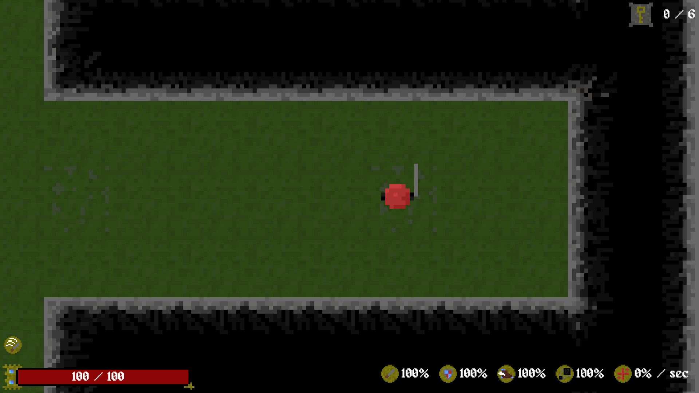

## Theme
Game made in a week with the theme of Small but fun and the optional constraint of folie sound
meaning that all sound effects had to be made from recording real world sounds, for example the
turret death noise is made from dropping tin cans on a bag

## Controls
Game uses WASD to move
Mouse for attack direction 
Q+E for size changes (has a cooldown)

## Screenshot

